最近一段时间，我主要在做三件事：练算法、维护自己的服务，以及把使用开源项目时做的修改提交回上游。

它们之间有不少联系。做题留下的代码需要归档，学过的算法需要整理成文章；为了让这些东西更方便地使用，又会去搭网站、接接口、维护服务器。这篇文章记录一下截至 2026 年 9 月，我在这些事情上的进展。

## 算法训练与博客

暑假做了一批强连通分量、割点割边、双连通分量和差分约束相关的题。其中，SCC 缩点、拓扑排序和 DAG 上的处理已经整理成了[第一篇刷题记录](/zh/posts/summer26-1-scc/)。

整理题解时，我想写清楚的不只是代码，还有建图的理由、缩点后保留的信息，以及边界情况为什么需要单独处理。能把这些问题讲明白，之后再遇到类似题目时，也更容易找到切入点。

### 让文章、代码和做题记录连起来

我把这组项目放在 [xw7qwq](https://github.com/xw7qwq) 组织下，各自负责一部分内容：

| 项目 | 作用 |
| --- | --- |
| [nfuwari](https://github.com/xw7qwq/nfuwari) | 博客本体，基于 Astro 和 Fuwari，保存文章与学习笔记 |
| [OJFlare](https://github.com/xw7qwq/ojflare) | 汇总多平台 AC、比赛和 Rating 记录，为最近提交与贡献图提供数据 |
| [CodeFlare](https://github.com/xw7qwq/codeflare) | 归档算法源码和模板，提供独立的代码检索、阅读入口 |
| [MacFlare](https://github.com/xw7qwq/macflare) | 提供 Mac 上的应用和音乐状态，在博客顶部展示应用图标与歌曲信息 |
| [.github](https://github.com/xw7qwq/.github) | 组织介绍、贡献说明和维护约定 |

博客文章用 Markdown 编写，经 Astro 构建后发布到 GitHub Pages，域名通过阿里云 ESA 分发。刷题记录和应用状态由浏览器向各自的公开 API 请求，CodeFlare 则作为独立的源码站点供文章引用。完整的网站结构可以在[关于页面](/zh/about/)查看。

OJFlare 的贡献图按 UTC+8 统计每道题的首次 AC；CodeFlare 保存的内容更广，还包括模板、尝试和未完成的代码。前者记录做题进度，后者留下推导和实现，两者配合起来，比较适合用来复盘。

## VPS 上的个人工具

截至 2026 年 9 月 22 日，我的 VPS 上运行着 19 组 Docker Compose 项目、34 个容器，另有一些由 systemd 或独立进程管理的服务。从评测、邮件到笔记和监控，日常会用到的工具逐渐聚到了一起。

这些服务大多基于已有开源项目。我做的事情主要是部署、配置，以及围绕自己的使用需求修改接口和界面。

### DMOJ：从提交代码到维护评测环境

和算法训练关系最紧密的是 [DMOJ](https://github.com/DMOJ/site)。这套部署包含网页、后台任务、通信桥、评测机、数据库和缓存，另有 PDF 服务与 HDU 特殊评测适配服务。

一次代码提交会经过网页接收、任务分发、编译运行和结果回传。平时在 OJ 上看到的提交状态、时间限制和比赛排名，到了自己的环境里，都成了需要配置和维护的具体环节。

我在这套部署中做了比赛计分、排名可见性和提交界面等适配，也接入了 HDU SPJ。题目迁移时，输入输出约定、checker 行为、编译环境和评分规则需要一起考虑。维护评测环境，让平时做题时接触到的规则有了更具体的实现。

### 邮箱：Stalwart 与 Bulwark

邮件服务端使用 Stalwart，网页客户端使用 [Bulwark Webmail](https://github.com/bulwarkmail/webmail)。我的部署包含按域名组织文件夹、JMAP 交互和 Passkey 登录相关的本地适配。

邮件客户端的工作涉及一整套状态：界面上的文件夹如何对应到服务端，登录状态怎样延续到后续请求，操作失败后又该如何提示。这些改动需要把界面、认证和协议放在一起考虑。

### 数据看板、笔记与信息获取

FitBaus 提供 Fitbit 数据看板和只读 API；Fast Note Sync 与 Obsidian 插件配合，同步笔记和附件。RSSHub、OpenList、TaoSync 等工具则承担信息获取、文件入口与同步工作。

这些服务处理的数据不同，维护时却经常遇到相似的问题：更新什么时候发生，失败后如何重试，旧数据是否仍然可用，以及怎样知道上一次成功同步的时间。它们也让我把注意力从单个页面，延伸到数据更新和多端状态上。

### 多人同步与接口适配

[DreamStream99](https://github.com/ypnomania/DreamStream99) 把 Win98 风格的静态前端与房间同步、媒体处理服务分开。多人一起观看视频时，播放、暂停、跳转和重新加入房间都需要同步，还要处理房主权限和重复操作。

NeXus / Xboard 这一组服务则包含前端、同源中间层和既有后端。中间层把浏览器操作映射到后端接口；前端根据接口实际提供的能力展示功能。这与我在 EZ-Theme 中做的兼容工作有直接联系。

### 配套服务与日常维护

其余工具主要负责入口、监控、通知和后台任务：

| 用途 | 项目或组件 |
| --- | --- |
| 反向代理与访问入口 | Caddy、Cerberus |
| 资源监控 | Komari、Beszel 及对应 Agent |
| 运维入口 | Nexterm |
| 消息通知 | Apprise |
| 订阅、文件与搜索 | RSSHub、Browserless、OpenList、Meilisearch、TaoSync |
| 日常管理与后台任务 | Wallos、qBittorrent、PT Tools、seed guard |
| 课程信息与工作流实验 | yuketang-cloud |
| 进程与部署管理 | systemd、Supervisor、Docker Compose |

服务部署之后，维护还会继续：处理异常、跟进上游更新、保存本地修改，以及整理升级和恢复步骤。容器的运行状态只是其中一部分，实际功能仍需要从使用过程去检查。

## 提交回上游的改动

我的 GitHub 账号是 [theLucius7](https://github.com/theLucius7)。除了维护自己的项目，我也会把使用开源软件时遇到的问题整理成 PR。

### QQ Chat Exporter

[QQ Chat Exporter #675](https://github.com/shuakami/qq-chat-exporter/pull/675) 处理的是 WebSocket 认证。网页通过 HTTP 完成认证之后，实时进度和流式搜索使用的 WebSocket 也需要携带访问令牌，重新连接时同样如此；HTTPS 入口则需要对应的 `wss` 连接。

随后提交的 [#677](https://github.com/shuakami/qq-chat-exporter/pull/677) 在 **2026 年 9 月 6 日** 合并，把实验性的私聊漫游查询接入了现有导出流程。

用户可以从已有私聊会话进入，也可以先通过 QQ 号查找对应的 `peerUid`。选定日期范围后，服务端创建任务、查找消息锚点并查询记录，再复用现有的消息解析、资源处理和格式导出能力。任务页提供进度、取消和下载入口。

这部分工作除了查询本身，还涉及任务排队、并发控制、取消和状态恢复。查询有日期跨度、消息数量和执行预算等限制；结果中保留不完整标记与停止原因，说明这次任务实际完成了什么。它仍是依赖已登录 QQ 和桥接能力的实验性私聊功能，不能保证恢复全部云端历史。

### 其他贡献

| 合并日期（UTC） | 项目与 PR | 内容 |
| --- | --- | --- |
| 2026-09-21 | [Daily_CF_Problems #15809](https://github.com/Yawn-Sean/Daily_CF_Problems/pull/15809) | 一份个人 C++ 题解 |
| 2026-09-06 | [QQ Chat Exporter #677](https://github.com/shuakami/qq-chat-exporter/pull/677) | 实验性私聊漫游查询与导出任务 |
| 2026-09-02 | [QQ Chat Exporter #675](https://github.com/shuakami/qq-chat-exporter/pull/675) | WebSocket 连接和重连时的认证 |
| 2026-08-18 | [DreamStream99 #1](https://github.com/ypnomania/DreamStream99/pull/1) | 服务端房间创建、房主与访客权限、播放操作去重和 YouTube 同步改进 |
| 2026-07-27 | [EZ-Theme #45](https://github.com/PangHu-Code/EZ-Theme/pull/45) | Xboard 礼品卡接口、会话字段与时间格式兼容、撤销会话和自动续费展示 |

Daily_CF_Problems 是另一种持续参与开源的方式：把日常做题留下的解法整理好，提交到共同维护的题解仓库。[已合并的题解 PR](https://github.com/Yawn-Sean/Daily_CF_Problems/pulls?q=is%3Apr+is%3Amerged+author%3AtheLucius7) 也记录了这部分积累。

## 比赛与获奖

这段时间的比赛记录包括 **4 项金奖、4 项银奖、3 项铜奖和 1 项三等奖**，共 12 个赛事阶段。团队赛的成绩也属于一起参赛的队友。

| 比赛日期 | 赛事 | 获奖 |
| --- | --- | --- |
| 2026-09-13 | 2026–2027 ICPC 贵州省赛 | 银奖，总榜第 10 名 |
| 2026-08-21 | 第八届码蹄杯 · 本科院校赛道国赛 | 金奖 |
| 2026-08-21 | 第 22 届百度之星 · 人才专项赛道决赛 | 金奖 |
| 2026-07-29 | ICPC 沈阳全国邀请赛 | 铜奖 |
| 2026-06-14 | 第十四届重庆市大学生程序设计大赛 | 银奖 |
| 2026-05-31 | 第十八届四川省大学生程序设计大赛 | 银奖 |
| 2026-05-30 | CCPC 全国邀请赛（福州） | 银奖 |
| 2026-05-24 | CCPC 全国邀请赛（秦皇岛） | 铜奖 |
| 2026-05-14 | 第八届码蹄杯 · 本科院校赛道四川省赛 | 金奖 |
| 2026-05-14 | 第 22 届百度之星 · 人才专项赛道省赛 | 金奖 |
| 2026-05-02 | ICPC 陕西全国邀请赛（西安） | 铜奖 |
| — | 第二届 CCF 算法能力大赛 | 三等奖 |

CCF 算法能力大赛证书落款为 2025-12-31。

### 证书

ICPC 贵州省赛（2026–2027 赛季） · 银奖 · 总榜第 10 名

The 2026-2027 ICPC China Guizhou Provincial Programming Contest。比赛日期：2026-09-13。

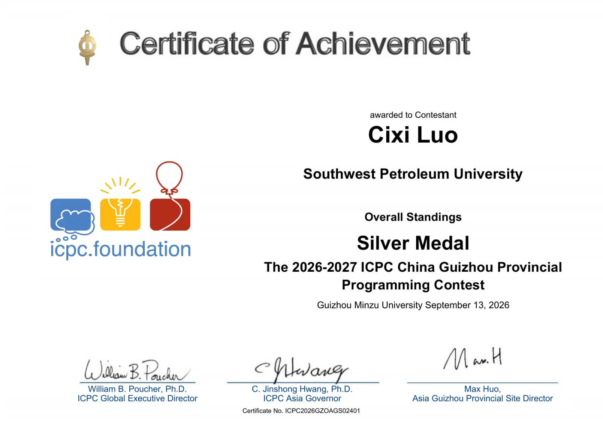

码蹄杯 · 国赛 · 金奖

2026 年第八届码蹄杯程序设计大赛本科院校赛道国赛。比赛日期：2026-08-21。

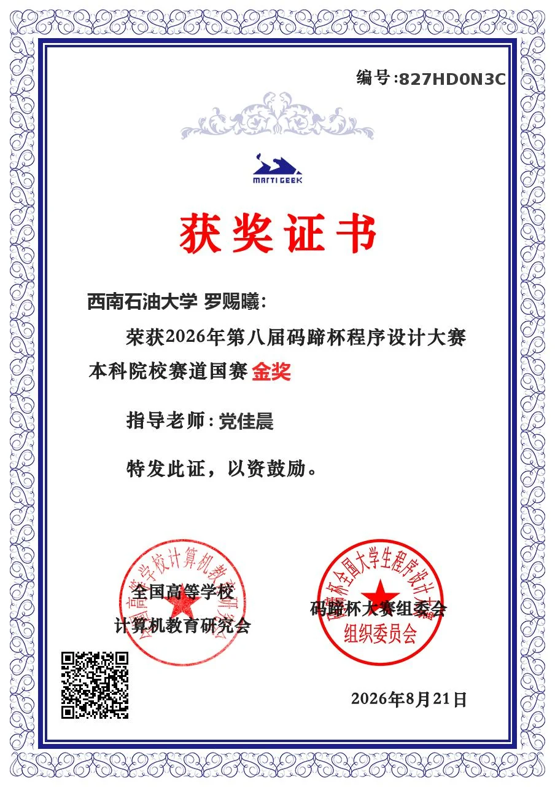

百度之星 · 决赛 · 金奖

第 22 届百度之星程序设计大赛决赛（人才专项赛道）。比赛日期：2026-08-21。

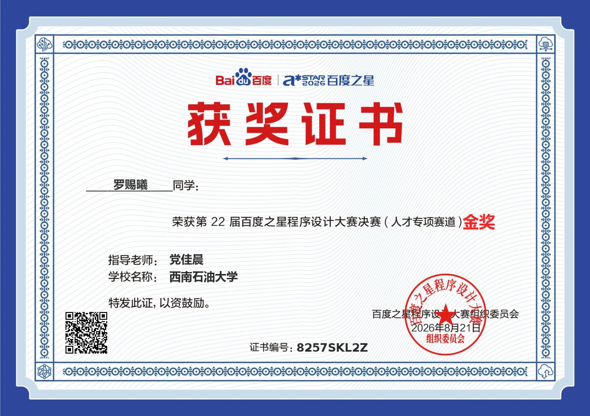

ICPC 沈阳邀请赛 · 铜奖

2026 ICPC China Shenyang National Invitational Programming Contest。比赛日期：2026-07-29。

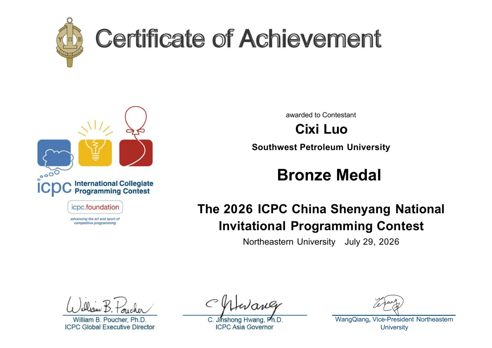

重庆市大学生程序设计大赛 · 银奖

2026 年重庆市第十四届大学生程序设计大赛。比赛日期：2026-06-14。

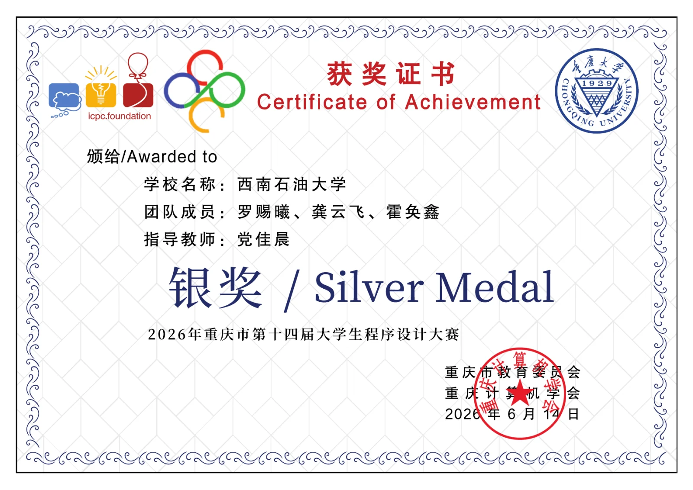

四川省大学生程序设计大赛 · 银奖

第十八届四川省大学生程序设计大赛。比赛日期：2026-05-31。

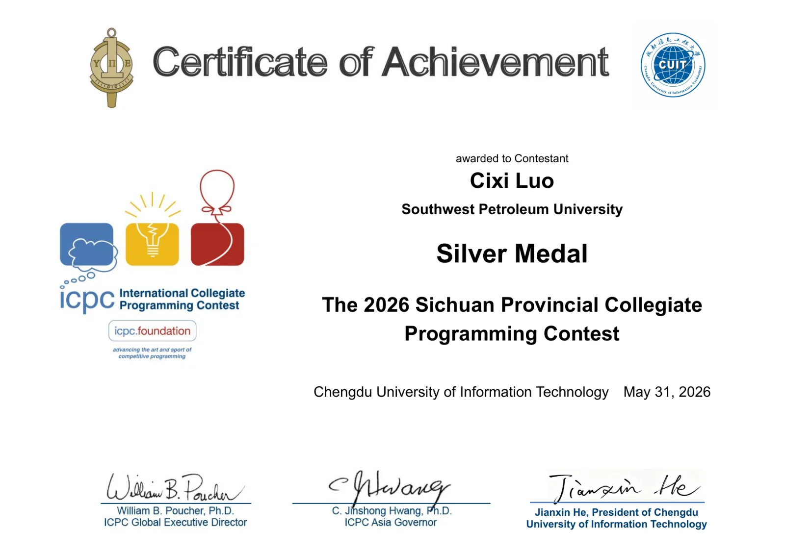

CCPC 福州邀请赛 · 银奖

2026 年中国大学生程序设计竞赛—全国邀请赛（福州）。比赛日期：2026-05-30。

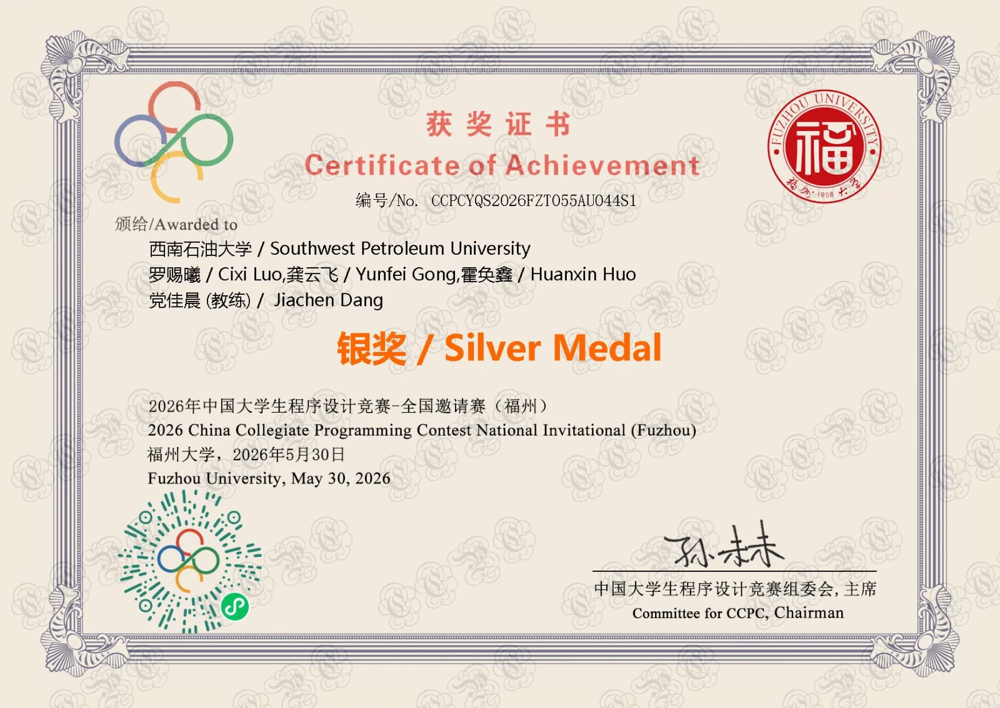

CCPC 秦皇岛邀请赛 · 铜奖

2026 年中国大学生程序设计竞赛全国邀请赛（秦皇岛）。比赛日期：2026-05-24。

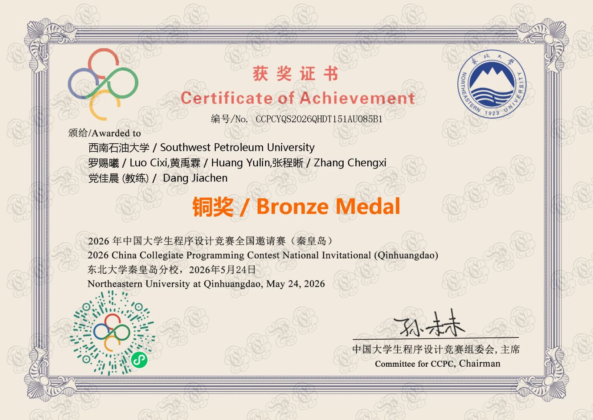

码蹄杯 · 四川省赛 · 金奖

2026 年第八届码蹄杯程序设计大赛本科院校赛道四川赛区省赛。比赛日期：2026-05-14。

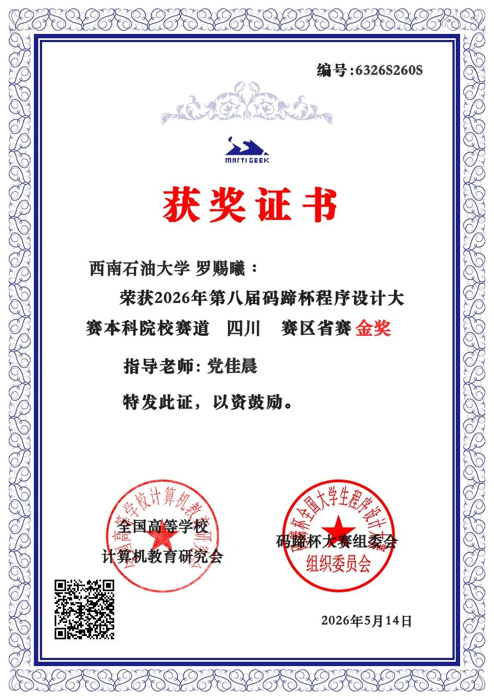

百度之星 · 省赛 · 金奖

第 22 届百度之星程序设计大赛省赛（人才专项赛道）。比赛日期：2026-05-14。

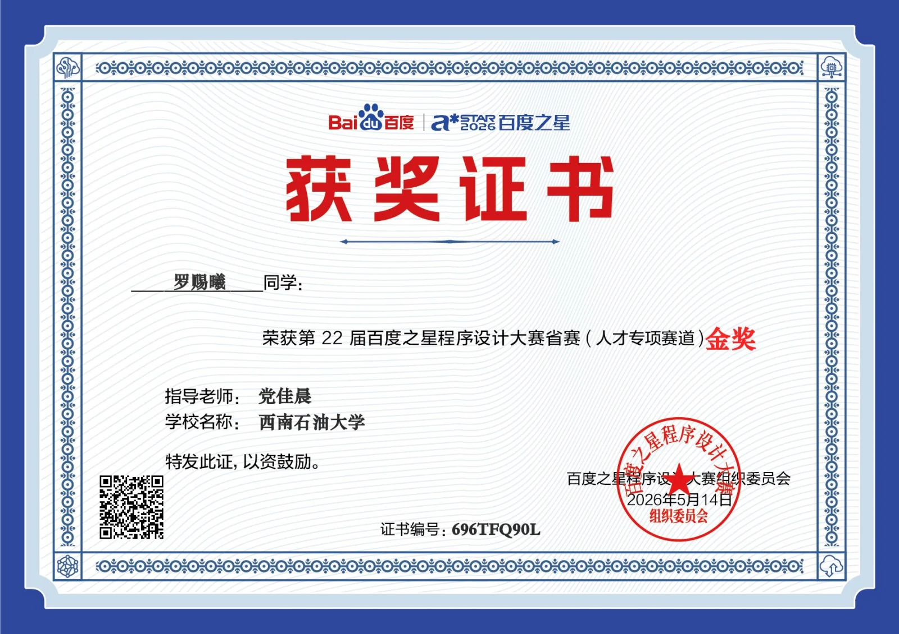

ICPC 陕西邀请赛（西安） · 铜奖

2026 ICPC China Shaanxi National Invitational Programming Contest。比赛日期：2026-05-02。

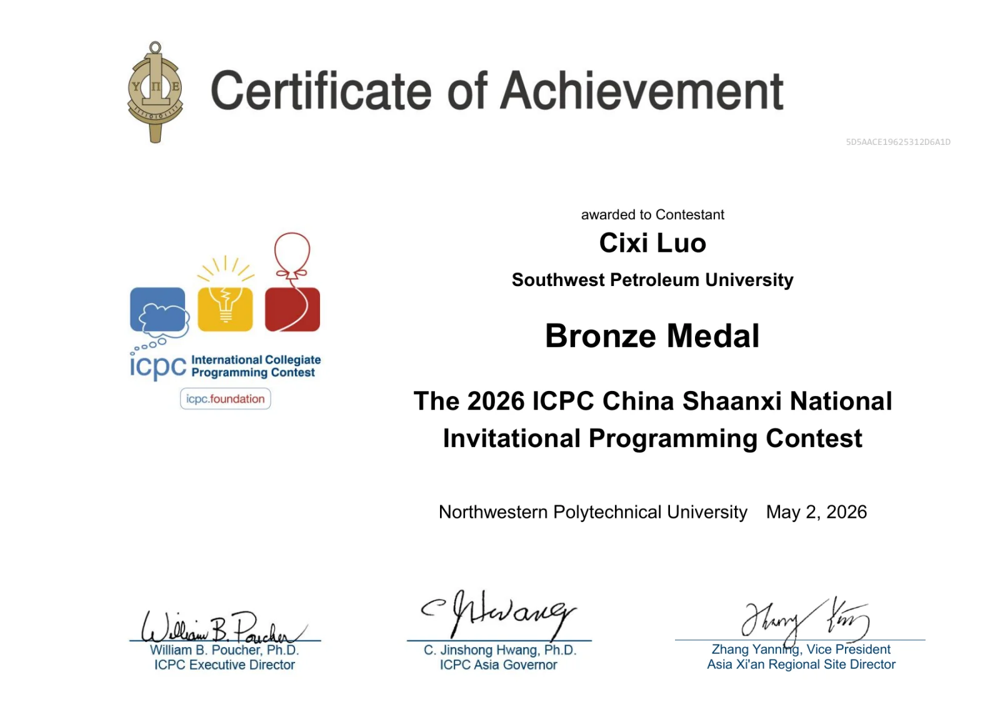

第二届 CCF 算法能力大赛 · 三等奖

第二届 CCF 算法能力大赛。证书落款：2025-12-31。

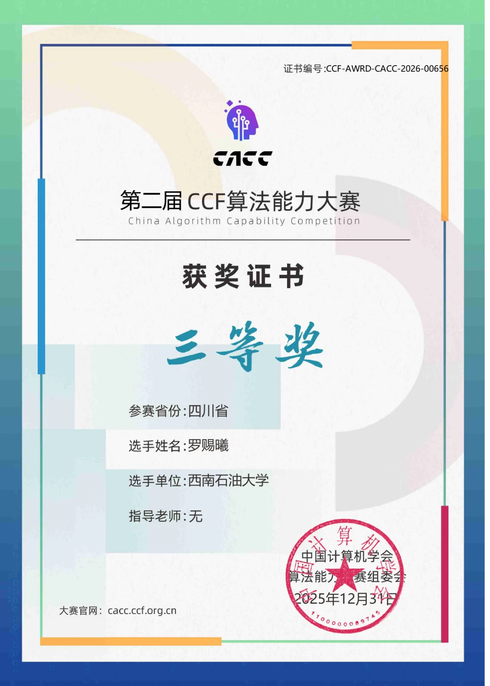

## 接下来

接下来想继续整理割点割边、双连通分量和差分约束的学习笔记，也把服务器上值得展开的部署与适配过程分别写下来。遇到适合独立提交的改动，就继续整理成 PR。

这篇文章先给最近的事情留一个位置。之后写新的笔记、维护服务或参加比赛时，再慢慢把它们接上。
